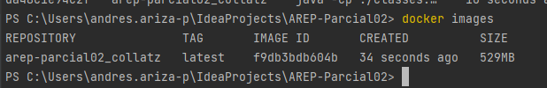

# Parcial 2do Tercio -Ejercicios de Diseño

## Pre requisitos

Es necesario tener java 8, maven y docker para correr la imagen

Use el siguiente comando para obtener una copia del proyecto

```git clone https://github.com/Andresariz88/AREP-Parcial02```

Use el siguiente comando para compilar el poroyecto

```mvn clean install```

## Local virtualizado

Se creó un servicio web con Spark en el que se capturan las preticiones GET a la
ruta ```/collatzsequence```, se obtiene el parámetro ```value```, se calcula la
secuencia de collatz de dicho parámetro y se devuelve en formato JSON.

Se virtualizó con Docker y se corrió localmente para probar el funcionamiento.


## AWS Virtualizado

Se creó una imagen con el servicio de Collatz



Se pusheó a Docker hub


En la instancia de EC2 de AWS instalamos java 8 y docker

Corremos la imagen


Y probamos


[Link del video de prueba](https://pruebacorreoescuelaingeduco-my.sharepoint.com/:v:/g/personal/andres_ariza-p_mail_escuelaing_edu_co/EVOZLl-eNMRLh6XVMZ42vyEBJNxBnk9Jor6ZfACes53pqw?e=Cu0i3g)